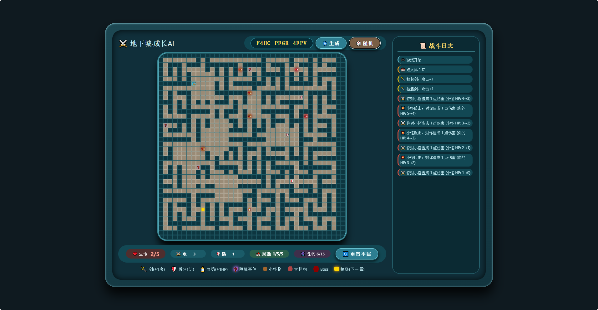

# 地下城爬塔 · 种子驱动Roguelike



## 📖 项目简介

这是一个受NetHack启发的**种子驱动Roguelike迷宫游戏**。每次游戏由种子决定5层地牢的完整布局、怪物分布、道具位置和随机事件。玩家需要不断成长，击败每层的怪物，最终在第5层Boss大厅面对终极挑战。

### 核心特色

- 🌱 **种子系统**：相同的种子永远生成相同的地牢，支持自定义种子
- 🏰 **五层地牢**：每层由算法生成迷宫+小房间结构，第5层为Boss大厅（双排柱子）
- 🧠 **智能怪物AI**：
  - 小怪/大怪：2格感知，根据实力对比（玩家战力vs怪物战力）决定追逐或逃跑
  - Boss：始终追逐玩家，永不逃跑
- 📈 **属性成长**：
  - 怪物属性随层数合理增长（小怪≤10，大怪≤15，Boss≤80）
  - 击败怪物有概率永久提升玩家属性
- 🎲 **随机事件**：地图上的❓格子触发事件，提供多种选择影响游戏进程
- 📜 **详细日志**：右侧日志栏记录战斗、拾取、AI行为和事件
- 📊 **分数系统**：游戏结束显示详细分数（杀敌、属性、道具、步数等）

## 🎮 如何开始

1. 直接打开 `index.html` 开始游戏
2. 使用键盘 **方向键** 移动玩家（⚔️图标）
3. 探索地牢，拾取道具（🗡️剑、🛡️盾、🧴血药）
4. 遭遇怪物会进入战斗，日志会显示伤害和血量
5. 走到金色楼梯（下一层）需要确认
6. 第5层击败Boss获得胜利

## 🧪 种子系统

种子格式：`XXXX-XXXX-XXXX`（字母数字组合）

- 输入种子点击"生成"可重现相同地牢
- 点击"随机"生成新种子
- 示例种子：`DNGN-MAZE-5LVL`

## 🧬 游戏机制详解

### 玩家属性
- **生命值**：初始5，可通过血药和事件增加
- **攻击力**：影响伤害输出
- **防御力**：减少受到的伤害

### 战斗公式
```
伤害 = max(1, 攻击方攻击 - 防御方防御 + 随机±1)
```
- 20%概率±1伤害浮动
- 击败怪物概率提升属性（小怪25%，大怪50%）

### 怪物战力计算
```
战力 = 攻击 + 防御 + floor(生命值 / 2)
```

### 分数计算
- 基础分：100
- 杀敌：小怪×10，大怪×25，Boss×500
- 属性：攻击×5，防御×5，剩余生命×10
- 道具：每个×20
- 步数：300 - 步数（最低0）
- 事件：每个×15
- 层数：每层×100

## 🏗️ 项目结构

```
dungeon-crawler/
├── index.html          # 主页面
├── css/
│   └── style.css       # 样式
├── js/
│   ├── main.js         # 入口
│   ├── core/           # 核心类
│   │   ├── game.js
│   │   ├── player.js
│   │   ├── monster.js
│   │   ├── maze.js
│   │   └── seed.js
│   ├── systems/        # 系统
│   │   ├── combat.js
│   │   ├── event.js
│   │   ├── log.js
│   │   └── score.js
│   ├── ui/             # 界面
│   │   ├── renderer.js
│   │   ├── modal.js
│   │   └── controls.js
│   └── utils/          # 工具
│       ├── rng.js
│       └── unionfind.js
└── README.md
```

## 🔧 核心算法

### 迷宫生成（Kruskal随机生成树）
1. 初始化所有奇行奇列为路
2. 随机遍历所有墙，若墙两边不连通则打通
3. 保证所有路节点连通且无环

### 房间生成
- 在迷宫基础上开凿小房间（3-6格）
- 每个房间随机打通1-4个出口连接到迷宫

### 种子驱动
- 使用种子哈希生成多个独立随机数流
- 迷宫、物品、怪物、事件分别使用不同偏移

## 🎯 未来计划

- [ ] 添加更多怪物种类
- [ ] 增加技能系统
- [ ] 支持存档功能
- [ ] 更多随机事件类型

## 📝 许可证

MIT License

---

**开始你的地下城冒险吧！** ⚔️🏰👾
